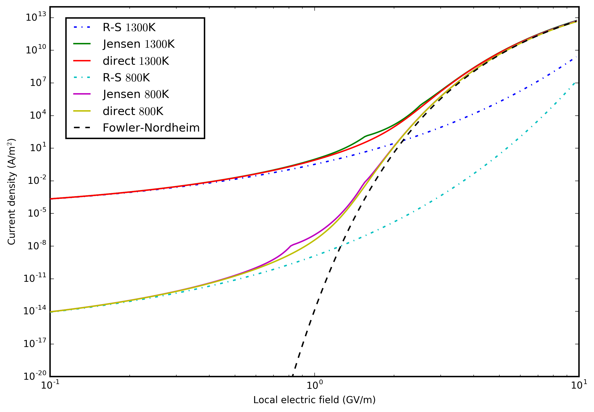
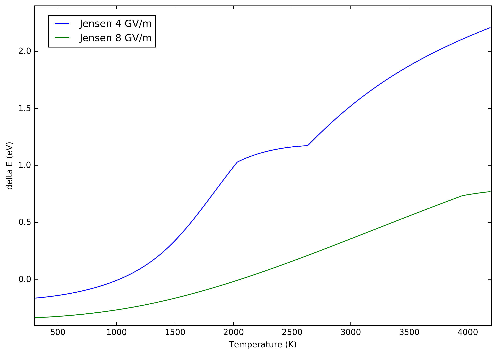

## Overview

This repository contains evaluations based on various theoretical models for calculating the emission current and Nottingham heating of a metal surface with a specified work function, temperature and applied electric field.

## Emission currents

Includes the following models:

* direct integration
* Fowler-Nordheim
* Richardson-Schottky
* Jensen's general thermal-field

The following figure shows the emission current for copper surface with work function of 4.5 eV.

## Nottingham heat

The following figure shows the Nottingham delta E (average energy of emitted electrons w.r.t. Fermi) for a copper surface with work function of 4.5 eV.

