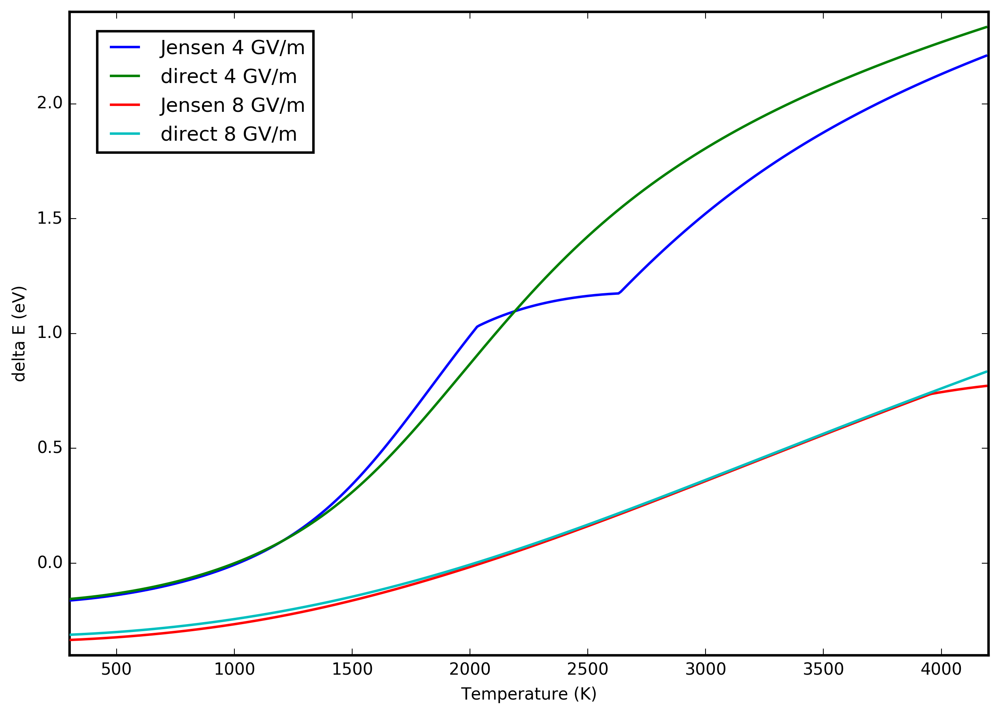

## Overview

This repository contains evaluations based on various theoretical models for calculating the emission current and Nottingham heating of a metal surface with a specified work function, temperature and applied electric field.

## Emission currents

## Nottingham heat

